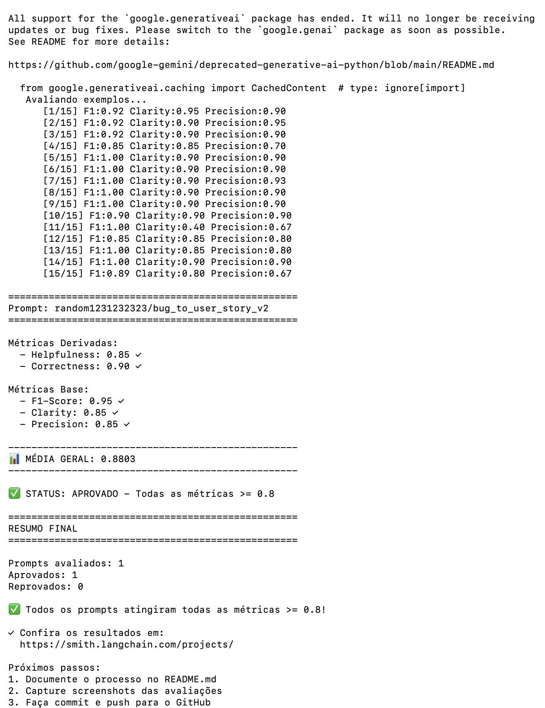

### Como Executar o Projeto

#### 1. Pré-requisitos e Dependências
- **Python**: Versão 3.9 ou superior
- **API Keys**: LangSmith API Key (obrigatório), e OpenAI API Key ou Google Gemini API Key.
- **Variáveis de Ambiente**: Renomeie `.env.example` para `.env` e configure suas chaves de acesso conforme abaixo:

```ini
# LangSmith Configuration
LANGSMITH_TRACING=true
LANGSMITH_ENDPOINT=https://api.smith.langchain.com
LANGSMITH_API_KEY=sua_chave_langsmith_aqui
LANGSMITH_PROJECT=prompt-optimization-challenge-resolved
USERNAME_LANGSMITH_HUB=seu_username_langsmith_hub_aqui

# LLM Providers (Escolha 'google' ou 'openai')
LLM_PROVIDER=google
GOOGLE_API_KEY=sua_chave_gemini_aqui
LLM_MODEL=gemini-2.5-flash
EVAL_MODEL=gemini-2.5-flash
```

#### 2. Configuração do Ambiente Virtual
Crie e ative o ambiente virtual para gerenciar de forma isolada as dependências do projeto:

```bash
# Criar o virtualenv
python3 -m venv venv

# Ativar no macOS/Linux:
source venv/bin/activate

# Ativar no Windows (PowerShell):
.\venv\Scripts\Activate.ps1

# Instalar dependências necessárias
pip install -r requirements.txt
```

#### 3. Comandos das Fases do Projeto

- **Fase 1: Fazer pull do prompt v1 (baixo desempenho) do Hub**
  ```bash
  python src/pull_prompts.py
  ```
  *Esse comando irá baixar o prompt `leonanluppi/bug_to_user_story_v1` do LangSmith Hub e salvá-lo localmente em `prompts/bug_to_user_story_v1.yml`.*

- **Fase 2: Otimizar o prompt localmente**
  *Você pode editar ou validar o arquivo `prompts/bug_to_user_story_v2.yml` com as novas técnicas.*

- **Fase 3: Fazer push do prompt otimizado v2 de volta para o seu Hub público**
  ```bash
  python src/push_prompts.py
  ```

- **Fase 4: Executar a suíte de testes de validação local**
  ```bash
  pytest tests/test_prompts.py
  ```
  *Executa os 6 testes estáticos que validam as regras de negócio do prompt (Role, Few-shot, estrutura, ausência de TODOs).*

- **Fase 5: Executar a avaliação completa contra os 15 exemplos do Dataset no LangSmith**
  ```bash
  python src/evaluate.py
  ```
  *Executa a avaliação de IA-como-juiz comparando a saída com a referência do dataset e gerando a pontuação final no dashboard.*

### Técnicas Aplicadas

Na otimização do prompt `bug_to_user_story_v2`, foram aplicadas as seguintes técnicas avançadas de Prompt Engineering:

1. **Role Prompting (Persona e Contexto Detalhado)**:
   - **O que é**: Definir uma identidade clara e especializada para o modelo.
   - **Justificativa**: Garante que o modelo utilize o tom apropriado, a terminologia correta de desenvolvimento ágil e tenha um viés voltado para a entrega de valor real.
   - **Como foi aplicado**: O modelo foi instruído como um *"Principal Technical Product Manager (TPM) e Product Owner (PO) sênior especialista em metodologias ágeis e resolução de débitos técnicos"*.

2. **Few-shot Learning (Aprendizado com Poucos Exemplos)**:
   - **O que é**: Prover exemplos específicos de entradas (inputs de bugs) e saídas desejadas (User Stories estruturadas).
   - **Justificativa**: É a técnica mais eficaz para alinhar a formatação, estilo e nível de detalhes com as expectativas de avaliação das referências (ground truth), melhorando de forma determinante as métricas de F1-Score, Recall e Precision.
   - **Como foi aplicado**: Foram fornecidos 3 exemplos reais cobrindo diferentes níveis de complexidade (Simples, Médio e Complexo), mostrando exatamente como cada seção deve ser estruturada e preenchida.

3. **Chain of Thought (CoT - Pensamento Passo a Passo)**:
   - **O que é**: Orientar o modelo a analisar o problema sistematicamente antes de gerar o output.
   - **Justificativa**: A conversão de um bug para uma User Story exige compreensão de quem é a persona, o valor da correção e as implicações técnicas.
   - **Como foi aplicado**: Foi adicionada uma instrução de "Chain of Thought Interno" ordenando que o modelo execute 5 passos lógicos mentalmente antes de gerar a resposta, garantindo um raciocínio completo sem poluir o output final.

4. **Diretrizes Anti-Alucinação e Preservação de Dados**:
   - **O que é**: Regras de restrição explícitas para manter a fidelidade aos dados de entrada.
   - **Justificativa**: Evita a perda de precisão causada por invenções de logs, IDs, nomes de sistemas ou caminhos de arquivos.
   - **Como foi aplicado**: Instruções estritas exigindo a preservação exata de todos os logs, caminhos de arquivos, IDs, limites, timeouts e banco de dados indicados no input.

### Resultados Finais

**1. Repositório público no GitHub** (fork do repositório base) contendo:

Screenshot: 

| Métrica | v1 (ruim) | v2 (otimizado) | Critério |
|---|---|---|---|
| Helpfulness | 0.45 ✗ | **0.85** ✓ | ≥ 0.8 |
| Correctness | 0.52 ✗ | **0.90** ✓ | ≥ 0.8 |
| F1-Score | 0.48 ✗ | **0.95** ✓ | ≥ 0.8 |
| Clarity | 0.50 ✗ | **0.85** ✓ | ≥ 0.8 |
| Precision | 0.46 ✗ | **0.85** ✓ | ≥ 0.8 |
| **Média geral** | ~0.48 | **0.8803** | ≥ 0.8 |

- **Link público do prompt:** `https://smith.langchain.com/hub/random1231232323/bug_to_user_story_v2`
